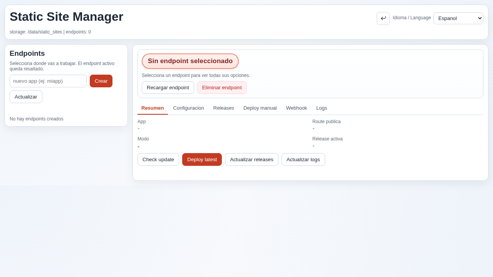

# @inventor-life/node-red-contrib-static-site-manager

Node-RED node for managing and serving static sites generated by Angular, React, Vue or plain HTML builds.

## Features

- Serves static site builds on custom routes from Node-RED runtime.
- Includes an admin UI at `/static-site-manager` for deployment operations.
- Supports manual uploads and webhook/provider-based deployment workflows.
- Provides a flow node (`static-site-manager`) for flow-level integration.
- Keeps deployment metadata, logs, and release state in Node-RED user directory.

## Installation

```bash
npm install @inventor-life/node-red-contrib-static-site-manager
```

## Install from Node-RED Palette Manager

1. Open Node-RED editor.
2. Go to Menu -> Manage palette -> Install.
3. Search for `@inventor-life/node-red-contrib-static-site-manager`.
4. Click Install.
5. Restart Node-RED if needed.

## Usage

Basic flow:

1. Add an `inject` node.
2. Add a `static-site-manager` node.
3. Add a `debug` node.
4. Configure `sitePath` and `route`.
5. Deploy and trigger the inject.

Expected behavior:

- The node forwards the incoming `msg`.
- It appends metadata in `msg.staticSiteManager` with `name`, `sitePath`, and `route`.
- Admin management UI is available at `/static-site-manager`.

## Configuration

Node properties:

- `name`: Optional display name.
- `sitePath`: Required path to static site build directory.
- `route`: Required public route prefix (example: `/static`).

Admin runtime paths:

- Panel: `/static-site-manager`
- API base: `/static-site-manager/api/*`

## Example

Example flow included:

- `examples/static-site-manager-example.json`

Import in Node-RED through Menu -> Import.

## Screenshots

### Node-RED Editor Home


### Static Site Manager Panel



### Node-RED Workspace


## Local development

```bash
cd /home/andres/noderedplugin/static-site-manager
npm pack

cd ~/.node-red
npm install /home/andres/noderedplugin/static-site-manager/inventor-life-node-red-contrib-static-site-manager-1.0.0.tgz
```

If your Node-RED userDir is different, install the tarball there.

## Publishing

```bash
npm login
npm publish --access public
```

## License

MIT - Inventor Life
